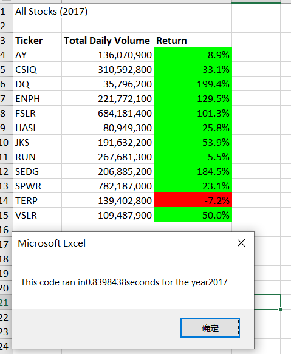
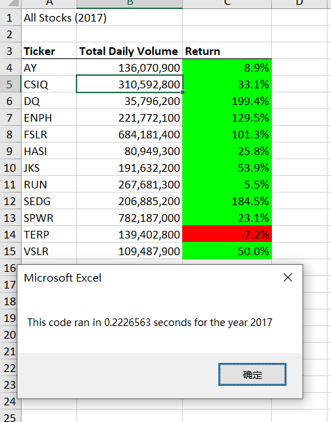
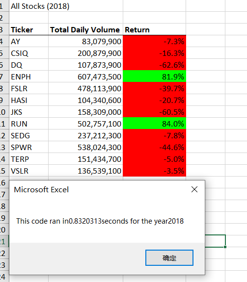
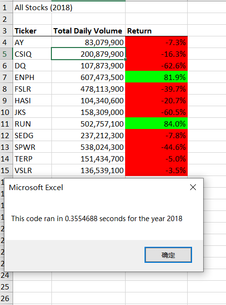

# Stocks Analysis report

## Overview 
After we have helped Steve with analyzing 12 stocks performance for 2017 and 2018 with their total trading volumes and year return values, Steve is intersted at analyzing the entire stock market instead of only 12 stocks. For our pervious solution, it works great but the algorithm is not good or efficient enough for thousands of stocks in the real market. We are rafactoring our code with better algorithm in order to handle the bigger dataset with better performance.

## Results
### The result comparison of execution time for 2017 stocks analysis between the original code and refactored code
|Original Code                                     |Refactored Code                                          |
|:----------:                                      |                                :-----------------------:|
|                           |                    |

### The result comparison of execution time for 2018 stocks analysis between the original code and refactored code
|Original Code                                     |Refactored Code                                          |
|:----------:                                      |                                :-----------------------:|
|                           |                    |

As you can see above, the execution time of refactored code is about 3 times even 4 times faster than the original code. For the original code, it went through all the rows of the stock, extract the all the information of the first ticker name. Then it repeated the process for another 11 times. The process it took is about 12 times the rows numbers it went through which is not efficient. For the refactored code, instead of going through the entire rows for 12 times, it went throught all the rows only once! The code is adjusting the target ticker name while it is going throught all the rows extracting the same information. In conlusion, the refactored code had grasped all the neccessary information by going throught the entire worksheet only once and it increases the execution speed significantly with the same final result.

## Summary
### advantages or disadvantages of refactoring code in general
The advantages of refactoring code is to optimize the algorithm and make it more efficient. The optimized code would run faster, occpied less memory and increase the overall performance. It might reqiure less on the hardware when the program is processing a large amount of data. 
The disvantages of refactoring code is that we might not understand the exact purpose or target of the original code if we are refactoring others' code. Sometimes the code is written in a way that fits the situation better. In addtion, if the orginal code is running great with not much negative impact, it could cost more for labor and time to refactor the code.

### advantages or disadvantages of refactoring code for our case
For our case, I believe we have more advantages of refactoring the code. The refactoring code has much faster execution speed and it could be used to analyze a much larger dataset with better performance. Furthermore, the stocks prices are chaning in every single second, the faster the analysis is ,the better opportunity we would have in the stock market. We did spend some time on refactoring the code, but the time we spent is not so long considerting that if we could save 2/3 time of analyzing a stock market contatining millions of stocks. Overall, it is worth refactoring the code to give us better analysis performance especially for analyzing a large amount of data.
